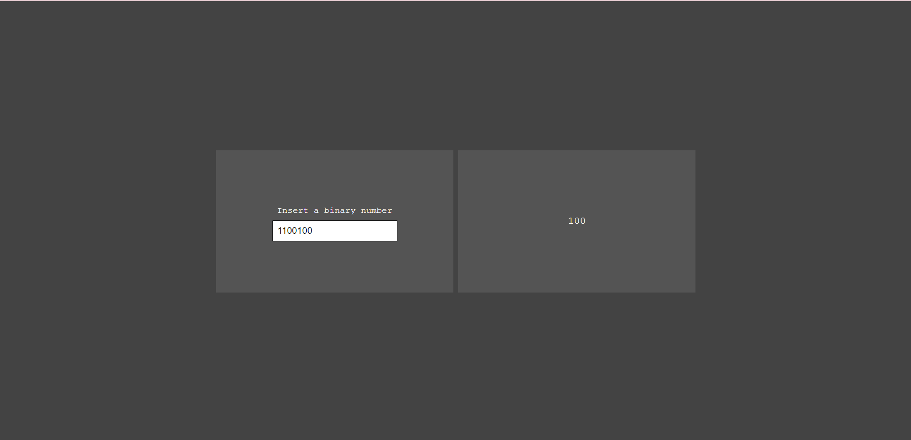

# :earth_americas: Bin2Dec

> Simple project that converts binary numbers to decimal numbers
## :man_factory_worker: Desenvolvedor

<table>
  <tr>
    <td align="center">
      <a href="#">
         
        
          <b>Thiago Felix</b>
        
      </a>
    </td>
  </tr>
</table>

## 📝 Licença

Esse projeto está sob licença. Veja o arquivo [LICENÇA](LICENSE) para mais detalhes.

